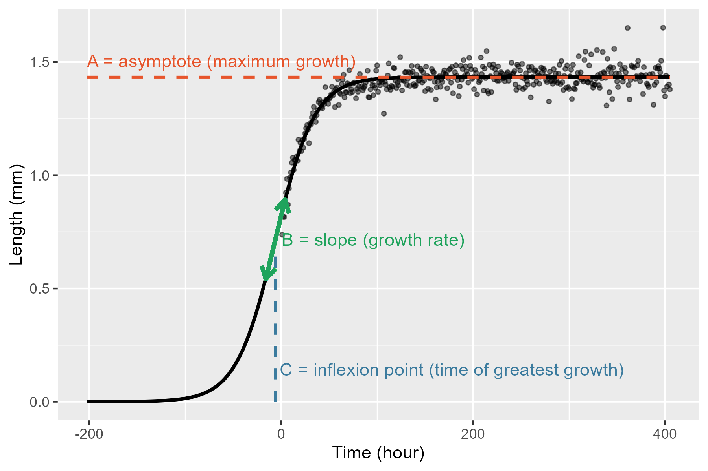

# L4_analysis_R: An R project for SydLab-One phenotypic data

## Overview
R project for *Caenorhabditis elegans* phenotypic analysis of SydLab One microfluidics system data. It accepts `.xlsx` files and generates analyses for growth, survival, fertility, motility and fluorescence data.

The following is a tutorial on the usage of this R project.
- If you need to install it, start from **Installation**.
- If you are analyzing data, start from **Growth analysis**, **Survival analysis**, etc.
- Remember to add the data as detailed in **Data files**.

> [!NOTE]
> This document **complements** the code documentation. Make sure to check the `[CUSTOM]` tags for each script before running the analyses, as they tailor your analysis to your needs.


## Installation
### 1. Install R and RStudio
Install R from [CRAN](https://cran.rstudio.com/). Choose the installer for your operating system  (Windows, Linux, or macOS). The analyses were tested with version 4.5.2, but the latest release will likely also work.

Install RStudio from [posit](https://posit.co/download/rstudio-desktop) for Windows, Linux, or macOS.  

### 2. Clone the repository
In RStudio:

1. Click **File -> New project**
2. Select **Version Control -> Git**
3. Paste the repository URL:

```
https://github.com/nuriagaralon/L4_analysis_R
```
4. Click **Create Project**

### 3. Install environment packages
1. From the bottom right panel, open the `Install_packages.R` script
2. Run the file from the top left panel, either by:
    - Selecting it all and `Ctrl + Enter`
    - Clicking the `Source` button

## Data files
All analysis scripts look for the relevant data files in the `L4_analysis_R/data` folder. Copy the following files there:

- Survival data: `[experimentID]_survival_condition.xlsx`
- Growth data: `[experimentID]_growth_filtered_raw.xlsx`
- Fertility data: : `[experimentID]_eggs_condition.xlsx` or `[experimentID]_eggs_channel.xlsx`
- Motility data: `[experimentID]_motility_filtered_raw.xlsx`
- Fluorescence data: `[experimentID]_fluo_raw_[light].xlsx`

## ANOVA
Growth, fertility and fluorescence analysis use one-way ANOVA and Tukey's HSD or Dunnet's test for post-hoc testing, or their non-parametric alternative, the Kruskal-Wallis test, with Dunn's post-hoc testing. Motility analysis uses mixed-measures two-way ANOVA, as well as estimated marginal means (EMMs) for post-hoc testing.

### Before the analysis
We must decide what kind of post-hoc test is appropriate for our experimental design:
- Tukey's HSD (and Dunn's test for non-parametric data): compares all possible pairs of groups to determine exactly which conditions are significantly different from each other.
- Dunnet's test: compares each condition only against the negative control. If the goal is simply to determine whether conditions differ from the baseline, and not whether they differ from each other, **this test is preferable because it has greater statistical power**.

Choosing the post-hoc test after seeing the results based on which one gives significant results **is a form of p-hacking** and can lead to misleading conclusions (can inflate false positive rates).

### After the analysis but before checking the results
We must check whether the following ANOVA assumptions are met. For this, we depend on the files `[analysis]_normality.png`

1. Normality of residuals: the q-q plot (right) must have all or most points in a diagonal line, within the grey area.
    - ANOVA is quite robust, so if a few points in the tail are outside the grey area, assumptions are still met.

If this assumption is not met, use the **Kruskal-Wallis** results.

2. Equality of variances: the scale-location plot (left) must have randomly distributed points. 
    - Usually, if the blue line is roughly horizontal, the assumption is met. 
    - Sometimes, the blue line is not horizontal due to one or two outliers. In this case, 
    - It is not met if, for example, we observe a pattern, such as a funnel or parabola.

ANOVA is robust to the violation of this assumption if group sizes are balanced, which is usually our case, unless many channels from one condition are unusable.


## Survival analysis

### Running the analysis from `survival_analysis.R`
The following steps include detailed explanations for some customizable parts, marked with `[CUSTOM]` within the R script. Those which are easier to explain have documentation within the code.

#### Pooling samples
When using files from multiple experiments, it is good to check if the data is similar enough to pool into one analysis. For this, we use the control condition, which is set with this variable:

```
control <- paste(c("N2", "OP50 100", "Water"), collapse = ".*") # [CUSTOM]
```
If the Log-rank test is significant (p-value < 0.05) it raises an error:

```
Replicates are too different, LRT pvalue = [number]
```
And shows the survival plot, where we can spot, for example, if worms died unexpectedly in one of the experiments, which allows us to assess how to continue (discarding that experiment, or filtering unreliable data, for instance).

### Survival Results
Survival results can be found in the `results/survival` folder.

#### Visualization plots
-	`survival.html` : Interactive Kaplan-Meier plot of all curves. Can have confidence intervals calculated as log(survival estimate).
-	`survival_set.html` : Interactive Kaplan-Meier plot of a specified subset of curves. Can have confidence intervals calculated as log(survival estimate).
-   `survival_set.png` : Image version of the subset of curves

#### Publication-ready plot
- `survival_argd.pdf` : shows plot of all curves and subset of curves.

## Growth analysis

### Running the analysis from `growth_analysis.R`
The following steps include detailed explanations for some customizable parts, marked with `[CUSTOM]` within the R script. Those which are easier to explain have documentation within the code.

#### Normalization
When the flag `normalize` is `TRUE`; area, volume and length are normalized by dividing them with `area.t0avg`, `volume.t0avg` and `length.t0avg`, which are calculated from the first six hours (first video, step < 7) for each condition of each experiment ID.

#### Convergence problems
Growth curves are modelled as a sigmoidal curve:

$$\text{growth}(t) = \dfrac{A}{1 + e^{-B(t - C)}}$$

<div align="center">
  
  
  *By Tristan Mahr (@tjmahr in Github)*
</div>

where:
- $A$, orange: upper asymptote = maximum nematode growth
- $B$, green: slope = growth rate
- $C$, blue: inflexion point = time where the rate of growth is greatest (variations shift the curve along the x axis without changing shape). 

Sometimes it is difficult for the model to converge, in which case the script will stop with a warning:
>One of the area/length/volume models is NULL, please rerun with a different C_start (try value_for_c = 40)

As $C$ is the most troublesome parameter, sometimes changing its value will allow convergence. So you should:

- Remove one # which are commenting the function, from:
```
# [O] If the model did not converge, change placeholder 
```
to
```
# End of [O]
```
- Change `placeholder` to the necessary `volume_data`, `area_data`, `length_data` and run the [O] section

- Click on the `volume_data`, `area_data` or `length_data` we just changed on the top right panel, and check the column `model`
    - If any of them are `NULL`, change `value_for_c` to another number and try again
    - If none are `NULL`, the model converged successfully and we can continue.

A similar convergence issue may happen at *Comparison 2: Logistic growth parameters*. There is, similarly, another `[O]` section with the same structure.

#### Set control variable
This is a rather simple customization. However, setting the control variable is crucial for post-hoc analyses, so please check that it is correct.

> [!CAUTION]
> By default, it searches the condition that contains "Water", and if it does not find it, it will likely raise the error: `! object 'p.adj.signif' not found`

### Growth Results
Growth results can be found in the `results/growth` folder. Since we always have each file in triplicate (for area, length, and volume) we will use `[variable]` as the placeholder. **Please check ANOVA section to correctly interpret the results.**

#### Visualization plots:
-	`growth_[variable].html` : Interactive plot of `[variable]` vs Time (hour). Values are averaged per each hour before modeling the logistic growth curve.
-	`growth_[variable]_rep.html` : Interactive plot of `[variable]` vs Time (h_nr, hour). Values are raw before modeling the logistic growth curves for every replicate. Data points are not shown. Here we can visualize if the replicates are different from each other.

#### AUC testing
Tests differences in area under the growth curve with numerical integration
-	`[variable]_normality_AUC.png` : ANOVA assumption plots 
-	`growth_AUC_[variable].txt` : statistical test results

#### Parameters (A, B, C) testing
Tests differences in logistic growth curves parameters
-	`[variable]_normality_A.png` : ANOVA assumption plots for parameter A
-	`[variable]_normality_B.png` : ANOVA assumption plots for parameter B
-	`[variable]_normality_C.png` : ANOVA assumption plots for parameter C
-	`growth_params_[variable].txt` : statistical test results for all parameters

#### Timepoint testing
Tests differences of `[variable]` (or variable_mod) at a specific `[timepoint]`, which is 80 hours by default.
-	`[variable]_normality_[timepoint].png` : ANOVA assumption plots
-	`growth_[timepoint]_[variable].txt` : statistical test results
-	`[variable]_[timepoint].png` : plot `[variable]` at `[timepoint]` vs condition. Error bars are mean $\pm$ SEM. Significance stars are taken from Dunnett's test results. Can be changed to be Tukey's HSD or Dunn's test. 

#### Publication-ready plot
- `growth_argd.pdf` : shows length, area, volume growth curves and timepoint plots

## Fertility analysis

### Running the analysis from `egg_analysis.R`
The following steps include detailed explanations for some customizable parts, marked with `[CUSTOM]` within the R script. Those which are easier to explain have documentation within the code.

#### Replicate
In fertility data, when we choose whether the experiment or the channel is the biological replicate, it also changes the required data files.
- For `channel <- TRUE` : takes channel as replicate, requires `eggs_channel` file/s
- For `channel <- FALSE` : takes experiment as replicate, requires `eggs_condition` files

If there is only one experiment to analyse, it must be the `eggs_channel` file.

### Fertility Results
Fertility results can be found in the `results/egg` folder. **Please check ANOVA section to correctly interpret the results.**

#### Visualization plots
-	`egg_count.html` : Interactive plot of normalized egg counts (A.U.) vs Time (days). Normalized egg counts are mean_eggs_per_worm/total_eggs for each condition. 

#### Egg count differences
Tests differences in the maximum egg count, the maximum normalized egg count and the time of this maximum egg laying.
-	`egg_norm_normality.png` : ANOVA assumption plots of maximum normalized egg count
-   `egg_count_egg_norm.txt` : statistical test results of maximum normalized egg count
-   `mean_eggs_per_worm_normality.png` :  ANOVA assumption plots of maximum egg count
-   `egg_count_mean_eggs_per_worm.txt` : statistical test results of maximum egg count
-   `Hour_normality.png`:  ANOVA assumption plots of time of maximum egg count
-   `egg_count_Hour.txt` : statistical test results of time of maximum egg count

#### Egg emergence
Tests differences in time of first egg emergence.
-	`egg_emergence_normality.png` : ANOVA assumption plots
-   `egg_emergence.txt` : statistical test results
-   `egg_emergence_plot.png` : time of first egg emergence vs condition. Error bars are mean $\pm$ SEM. Significance stars are taken from Dunnett's test results. Can be changed to be Tukey's HSD or Dunn's test. 

#### Publication-ready plot
- `egg_argd.pdf` : shows egg emergence and egg count plots

## Motility analysis

### Running the analysis from `motility_analysis.R`
The following steps include detailed explanations for some customizable parts, marked with `[CUSTOM]` within the R script. Those which are easier to explain have documentation within the code.

#### Dealing with unbalanced data
Mixed-measures two-way ANOVA cannot work with unbalanced data, so it erases the corresponding rows. So, if one channel is shorter than the others, it is removed. There are four options:

1. Use all data. Fill missing data points with 0 (which in this data means the worm does not move).
2. Use all data as is. It will remove incomplete replicates.
3. Use data separated per experiment. Fill missing data points with 0.
4. Use data separated per experiment as is. It will remove incomplete replicates. This option is not recommended, as the data may end up with only one replicate. 

The default is:
```
option <- 1
```

#### Sphericity
Sphericity is an assumption of two-way ANOVA that can be corrected by:
- Greenhouse-Geisser correction (more strict): use specially when epsilon < 0.75
- Huynh-Feldt correction: some statisticians (Girden 1992) recommend it if epsilon > 0.75

This corrects the p-values to control false positives.

### Motility Results
Motility results can be found in the `results/motility` folder. Since we always have each file in quadruplicate (for head amplitude, tail amplitude, displacement speed and bodybends frequency) we will use `[variable]` as the placeholder. **Please check ANOVA section to correctly interpret the results.**

#### Visualization plots
-	`motility_[variable].html` : Interactive plot of `[variable]` vs Time (day). Error bars are mean $\pm$ SEM. 

#### Motility over time
Tests differences in `[variable]` over time (days) with a two-way ANOVA. `[filltype]` refers to how the data was treated (see in Running the analysis above).
-	`young_[variable]_normality.png` : ANOVA assumption plots for young worms (1-10 days)
-	`motility_[filltype]_[variable]_young.txt` : statistical test results for young worms (1-10 days)
-	`old_[variable]_normality.png` : ANOVA assumption plots for old worms (11-20 days)
-	`motility_[filltype]_[variable]_old.txt` : statistical test results for old worms (11-20 days)

#### Publication-ready plot
- `motility_argd.pdf` : shows head amplitude, tail amplitude, displacement speed and bodybends frequency plots

## Fluorescence analysis

### Running the analysis from `fluo_analysis.R`
The following steps include detailed explanations for some customizable parts, marked with `[CUSTOM]` within the R script. Those which are easier to explain have documentation within the code.

#### Chambers to use
The chambers to use for fluorescence analysis have to be written into the `data/fluo_chambers_use.xlsx` file, in the following format:

| Experiment_ID_1      | Experiment_ID_2      | ..  |
|----------------------|----------------------|-----|
| chip-channel-chamber | chip-channel-chamber | ... |
| ...                  | ...                  | ... |

Each column corresponds to one experiment, and each row contains a chamber identifier in the format `chip-channel-chamber`. For instance, chip A, channel 2, chamber 8 would be A-2-8.

Chosen chambers should contain only one worm, as fluorescence intensity is not directly proportional to worm number. A minimum of three chambers per condition is recommended, although five or more is preferable for robust analysis.

#### Set start hour
Initial fluorescence readings are often artificially high. Therefore, the `initial_check.html` plot is created to see when it stabilizes. Set `start_hour` as the hour when it first stabilizes.

### Fluorescence Results
Growth results can be found in the `results/growth` folder. Since we always have each file in triplicate (for area, length, and volume) we will use `[variable]` as as the placeholder. **Please check ANOVA section to correctly interpret the results.**

#### Visualization plots
-	`initial_check.html` : Interactive plot of Fluorescence Intensity vs Time (hour). Shows at what hour the measurements stabilize.
-	`fluo_FC_hour.html` : Interactive plot of Fluorescence Fold Change vs Time (h_nr, hour). Error bars are mean $\pm$ sd. Helps select interesting timepoint.

#### Timepoint testing
Tests differences of fluorescence fold change at a specific `[timepoint]` .
-	`fluo_[timepoint]_normality.png` : ANOVA assumption plots
-	`fluo_[timepoint].txt` : statistical test results
-	`fluo_[timepoint].png` : plot fluorescence fold change at `[timepoint]` vs condition. Error bars are mean $\pm$ SEM. Significance stars are taken from Dunnett's test results. Can be changed to be Tukey's HSD or Dunn's test. 

#### Publication-ready plot
- `fluo_[timepoint].pdf` : `fluo_[timepoint].png` in pdf form